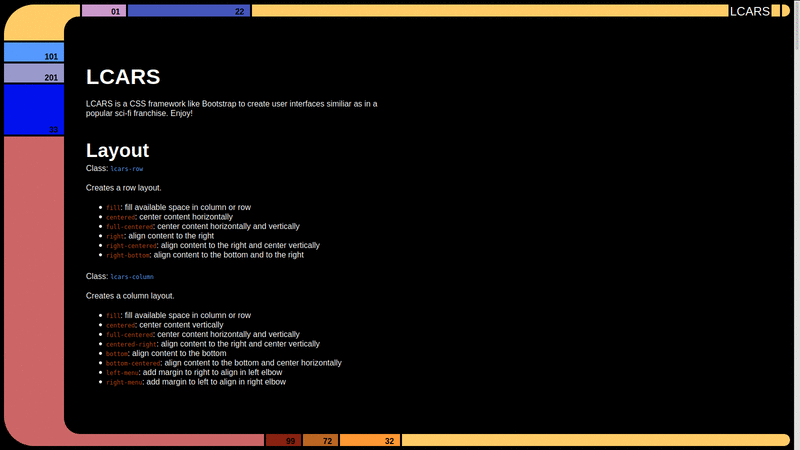

LCARS (Library Computer Access Retrieval System)
================================================

#### Now with 'active' color tags

LCARS is a CSS framework like [Bootstrap](http://getbootstrap.com/), [Foundation](http://foundation.zurb.com/), [Topcoat](http://topcoat.io/), [Brick](http://mozilla.github.io/brick/index.html), or [Pure](http://purecss.io/).

It's purpose is to create websites inspired by the user interface of a popular sci-fi franchise.

This fork intends to extend on the work of *joernweissenborn* to add styles for the console buttons.

Lcars is written in [Stylus](http://learnboost.github.io/stylus/).

## Demo And Documentation

[See](http://joernweissenborn.github.io/lcars/)

## Problems Or Feature Requests

I will accept input on this fork of the project and hopefully contribute to the main project

## Contributing

For all LCARS related changes, please try contributing with the joernweissenborn project. Changes specific to this fork are welcomed here.

## Thanks

Thanks to @garrett- for initial development!

Thanks to @jrwarwick for audio support!

Thanks to @joernweissenborn for the original
